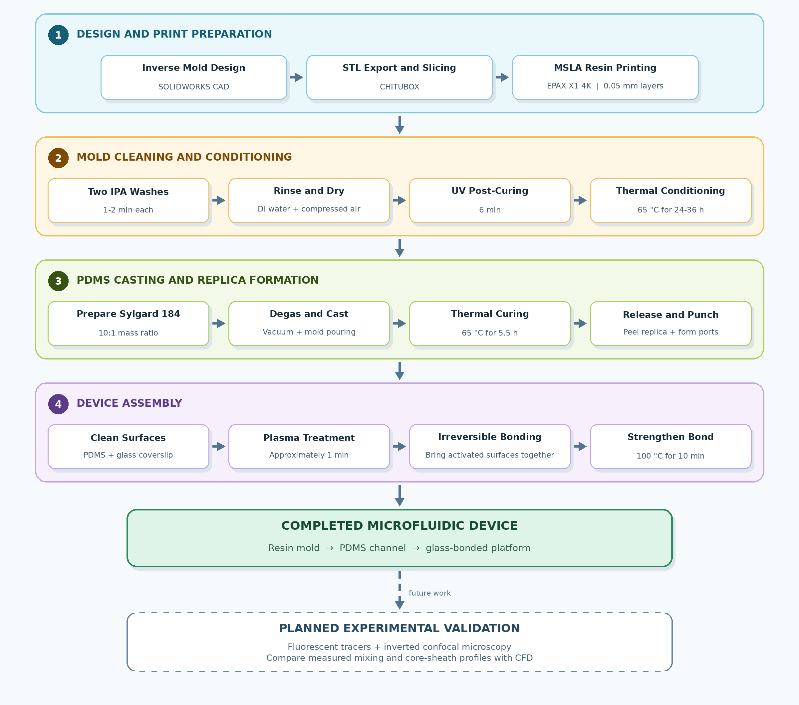

# Fabrication of a Staggered-Herringbone PDMS Microfluidic Device

Fabrication of resin-printed molds and PDMS microfluidic devices for experimentally validating CFD-optimized staggered-herringbone mixing. The workflow covers CAD preparation, SLA printing, mold post-processing, PDMS casting, and plasma bonding.

## Overview

This project presents the manufacturing workflow used to translate CFD-optimized microfluidic geometries into physical polydimethylsiloxane (PDMS) devices. 

## Objectives

- Convert the selected simulated microfluidic geometry into a printable inverse mold.
- Manufacture the mold using high-resolution resin 3D printing.
- Establish a post-processing procedure compatible with PDMS casting.
- Cast, cure, and release the PDMS microchannel without damaging its internal features.
- Permanently bond the PDMS channel to a glass coverslip.
- Prepare the device for future fluorescence-based flow experiments.

## Methodology

<p align="center">

</p>


## Mold Design

The microfluidic channel was converted into an inverse mold so that the raised printed features would form recessed channels in the cured PDMS. The mold was exported as an STL file and prepared for printing in CHITUBOX software.

| Mold parameter | Value |
|---|---:|
| Width | 30 mm |
| Length | 36 mm |
| Height | 7 mm |
| Feature type | Inverse staggered-herringbone microchannel |

<p align="center">
  
</p>

<p align="center"><em>Inverse mold design used to manufacture the PDMS microfluidic channel.</em></p>

## Resin Printing

The mold was printed using an EPAX X1 4K MSLA printer and white eResin-PLA Pro. The slicing parameters were selected to preserve the small herringbone features while maintaining a practical fabrication time.

| Printing parameter | Setting |
|---|---:|
| Printer | EPAX X1 4K |
| Resin | White eResin-PLA Pro |
| Slicer | CHITUBOX |
| Layer height | 0.05 mm |
| Normal-layer exposure | 3 s |
| Bottom-layer exposure | 65 s |

<p align="center">
  
</p>

## Mold Post-Processing

Freshly printed resin can inhibit PDMS curing if residual resin or reactive surface species remain on the mold. The following post-processing procedure was therefore applied:

1. Clean the printed mold in isopropyl alcohol twice for approximately 1–2 minutes per wash.
2. Rinse the mold with deionized water.
3. Dry the mold using compressed air.
4. UV-cure the mold for 6 minutes.
5. Bake the mold at 65 °C for 24–36 hours before PDMS casting.

<p align="center">
  
</p>

<p align="center"><em>Post-processed resin mold containing the inverse herringbone features.</em></p>

## PDMS Preparation and Curing

Sylgard 184 base and curing agent were mixed at a mass ratio of **10:1**. The mixture was degassed under vacuum to remove trapped air, poured over the prepared mold, and thermally cured.

| Process parameter | Setting |
|---|---:|
| PDMS material | Sylgard 184 |
| Base-to-curing-agent ratio | 10:1 by mass |
| Degassing method | Vacuum |
| PDMS curing temperature | 65 °C |
| PDMS curing time | 5.5 h |

After curing, the PDMS replica was carefully peeled from the resin mold. Inlet and outlet ports were then punched at the required locations.

## Device Bonding

The PDMS surface and glass coverslip were cleaned and plasma-treated for approximately **1 minute**. The activated surfaces were brought into contact to form an irreversible seal. The assembled device was then heated at **100 °C for 10 minutes** to strengthen the bond.

<p align="center">
  
</p>

<p align="center"><em>Completed PDMS microfluidic device after port formation and glass bonding.</em></p>

## Results

The fabrication workflow successfully converted the selected simulation geometry into a physical resin mold and a sealed PDMS microfluidic device. The printed mold reproduced the inverted staggered-herringbone features required to form the internal channel, and the cured PDMS layer was released and bonded to glass to produce the final experimental platform.

This chapter demonstrates **manufacturability**, not experimental confirmation of mixing or sheathing performance. Flow experiments are still required to determine how closely the physical device reproduces the CFD predictions.

## Key Outcome

> The CFD-designed microfluidic geometry was successfully translated into a resin-printed mold and a bonded PDMS device, establishing the physical platform needed for experimental validation.

## Experimental Validation Plan

Future testing will introduce fluorescent tracer particles or beads into the device and image their distribution using inverted confocal microscopy. The experimental measurements can then be compared with simulated concentration or phase distributions.

Planned work includes:

- Quantifying mixing performance from fluorescence intensity distributions.
- Comparing experimental mixing indices with CFD predictions.
- Measuring core width and height under different sheath-to-core flow-rate ratios.
- Integrating the mixing and sheathing functions into a single microfluidic device.
- Investigating the effects of material properties and particle adhesion to channel walls or herringbone features.
- Updating the computational model if experiments reveal particle-wall interactions not represented in the original simulations.

## Limitations

- Experimental mixing and sheathing measurements have not yet been completed.
- Feature fidelity is limited by printer resolution, slicing settings, and resin shrinkage.
- Residual resin chemistry can inhibit PDMS curing if post-processing is insufficient.
- Port punching, PDMS release, and plasma bonding may introduce device-to-device variation.
- The numerical models may require refinement if particles adhere to the channel surfaces during experiments.

## Tools and Materials

- **CAD:** SOLIDWORKS
- **Slicing:** CHITUBOX
- **3D printing:** EPAX X1 4K MSLA printer
- **Mold material:** White eResin-PLA Pro
- **Device material:** Sylgard 184 PDMS
- **Bonding:** Plasma treatment and thermal strengthening
- **Planned imaging:** Inverted confocal microscopy

## Repository Structure

```text
microfluidic-device-fabrication/
├── README.md
├── cad/
│   ├── mold_model.STL
│   └── mold_dimensions.md
├── printing/
│   ├── slicer_settings.md
│   └── print_files/
├── protocols/
│   ├── mold_post_processing.md
│   ├── pdms_casting.md
│   └── plasma_bonding.md
├── images/
│   ├── Figure_17_PDMS_Mold_Design.png
│   ├── Figure_18_3D_Printing_Setup.png
│   ├── Figure_19_Printed_Inverted_Herringbone_Mold.png
│   └── Figure_20_Completed_PDMS_Device.png
└── results/
    └── experimental_validation/
```

> **Note:** Large CAD, STL, simulation, or microscopy files should be stored with [Git Large File Storage](https://git-lfs.com/) or attached to a GitHub Release if they exceed GitHub's normal file limits.

## Related Simulation Projects

- Staggered-herringbone microfluidic mixing simulation
- Core-sheath microfluidic flow simulation using the Volume of Fluid method

## Citation

If you use this work, please cite:

```bibtex
@mastersthesis{islam2025microfluidics,
  author = {Touhid Islam},
  title = {Modeling and Manufacturing of Hierarchically Structured Multi-Materials via Microfluidics},
  school = {Montana State University},
  year = {2025},
  month = {August}
}
```

## Acknowledgment

This work was supported by the U.S. National Science Foundation under Award No. 2144845.

## License

Add the license that matches how you want others to reuse the files. For open-source project documentation, the MIT License is a common choice; CAD files and figures may instead require a separate reuse notice.

